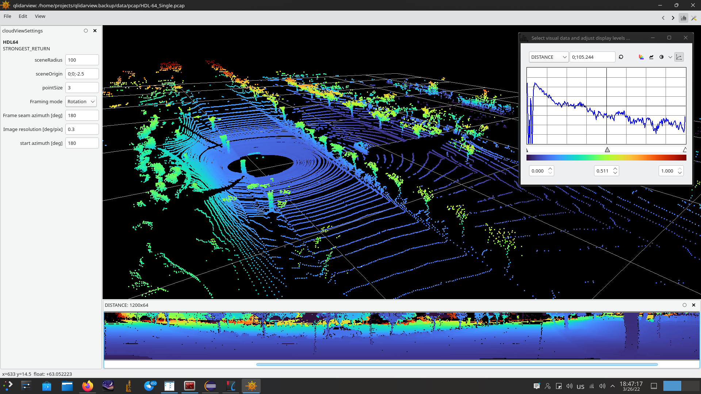

# qlidarview

Simple LiDAR .pcap file viewer based on libQGLViewer.

This is experimental code for parsing and visualization of LiDAR .pcap files.

It visualizes 3D lidar point cloud and some range images (distances, depths, heights, etc...). 

No any other functionality is implemented.

Formally supported LiDARs at moment are VLP16, VLP32C, HDL32E, HDL64 and VLS128,
but no extensive testing was made yet because I still waiting for actual datasets 
appropriate for testings purposes.

The conversion to point clouds and range images completelly rely onto calibration tables which usually should be provided by sensor manufacturer.
The default calibration parameters hardcoded into application are collected from public LiDARs user manuals and VeloView .xml files.

The datalink types curretly supported are only DLT_NULL=0 (BSD loopback encapsulation), DLT_EN10MB=1 (Ethernet (10Mb)),
DLT_LINUX_SLL=113 (Linux cooked sockets) and DLT_LINUX_SLL2=276 (Linux cooked sockets v2).

The example of tcpdump command line to capture lidar data and write into pcap file :
 
 
   $ tcpdump -vv -i any -u "src 192.168.2.201 and udp and port 2368" -w output.pcap

The build dependencies are 

	pcap
	tinyxml2
	tbb 
	libtiff 
	opencv
	glu 
	freeglut 
	glew 
	qt5-declarative 
	qt5-imageformats 
	qt5-multimedia 
	qt5-graphicaleffects

	libqglviewer (http://libqglviewer.com)

